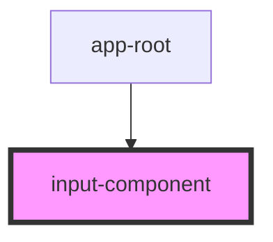

# input-component

<!-- Auto Generated Below -->

## Properties

| Property      | Attribute     | Description | Type       | Default     |
| ------------- | ------------- | ----------- | ---------- | ----------- |
| `checked`     | `checked`     |             | `boolean`  | `false`     |
| `label`       | `label`       |             | `string`   | `undefined` |
| `name`        | `name`        |             | `string`   | `undefined` |
| `options`     | --            |             | `string[]` | `[]`        |
| `placeholder` | `placeholder` |             | `string`   | `undefined` |
| `rows`        | `rows`        |             | `number`   | `4`         |
| `type`        | `type`        |             | `string`   | `'text'`    |
| `value`       | `value`       |             | `string`   | `undefined` |

## Dependencies

### Used by

 - [app-root](../app-root)

### Graph

----------------------------------------------

*Built with [StencilJS](https://stenciljs.com/)*
