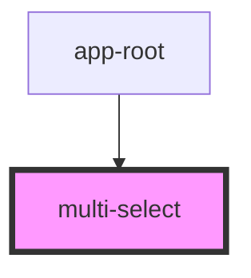

# multi-select

<!-- Auto Generated Below -->

## Properties

| Property  | Attribute | Description | Type                                  | Default |
| --------- | --------- | ----------- | ------------------------------------- | ------- |
| `options` | --        |             | `{ value: string; label: string; }[]` | `[]`    |

## Events

| Event              | Description | Type                    |
| ------------------ | ----------- | ----------------------- |
| `selectionChanged` |             | `CustomEvent<string[]>` |

## Dependencies

### Used by

 - [app-root](../app-root)

### Graph

----------------------------------------------

*Built with [StencilJS](https://stenciljs.com/)*
